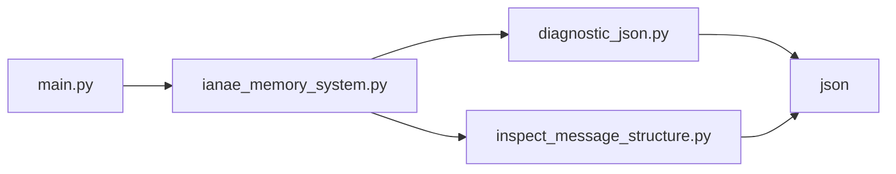

# 📚 Documentación Consolidada de IANAE

## 📑 Índice
1. [Módulos Principales](#módulos-principales)
2. [Sistema de Memoria](#sistema-de-memoria)
3. [Herramientas de Análisis](#herramientas-de-análisis)
4. [Dependencias Comunes](#dependencias-comunes)

## 🏗️ Módulos Principales

### main.py
[Contenido previo...]

### nucleo.py
[Contenido previo...]

## 🧠 Sistema de Memoria

### ianae_memory_system.py

### 🔍 Herramientas de Análisis

#### diagnostic_json.py
```python
"""
Módulo para analizar estructura de archivos JSON en el sistema IANAE

Funcionalidades:
- Diagnóstico de estructura JSON
- Detección de palabras clave
- Validación básica de formato
- Reporte de errores
"""
```

**Funciones Principales:**
- `diagnose_json_structure()`: Analiza estructura de archivos JSON
- `find_text_with_keywords()`: Busca palabras clave en texto

**Ejemplo:**
```python
diagnose_json_structure()  # Analiza primeros 5 archivos JSON
```

**Ver documentación completa en:** [diagnostic_json_docs.md](./diagnostic_json_docs.md)

#### inspect_message_structure.py
```python
"""
Módulo para inspeccionar estructura de mensajes en archivos JSON

Funcionalidades:
- Análisis profundo de un archivo específico
- Extracción de metadatos de mensajes
- Identificación de campos con texto significativo
"""
```

**Funciones Principales:**
- `inspect_one_file_deeply()`: Analiza un archivo en profundidad
- `find_text_fields()`: Busca campos con texto significativo

**Ejemplo:**
```python
inspect_one_file_deeply()  # Analiza archivo específico
```

**Ver documentación completa en:** [inspect_message_structure_docs.md](./inspect_message_structure_docs.md)

## 📦 Dependencias Comunes

| Módulo       | Uso Principal                     |
|--------------|-----------------------------------|
| `json`       | Procesamiento de archivos JSON    |
| `os`         | Operaciones de sistema de archivos|
| `re`         | Expresiones regulares             |
| `sqlite3`    | Base de datos de conceptos        |

## 🔗 Relación Entre Módulos

