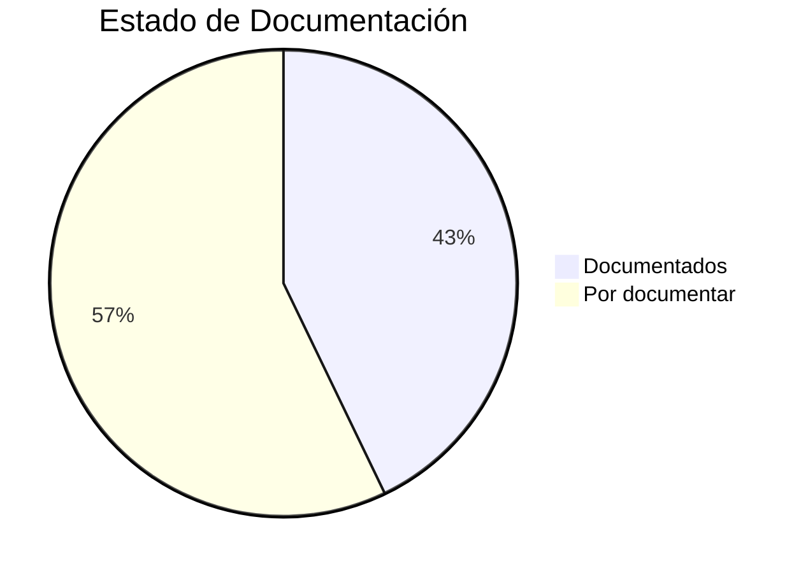

# 📊 Estado de Documentación - Archivos Python

## 📅 Última actualización: 29/5/2025, 8:38 a.m.

| Archivo Python | Documentado | Archivo de Documentación |
|----------------|------------|--------------------------|
| `deep_content_analysis.py` | ✅ Sí | `deep_content_analysis_docs.md` |
| `diagnostic_json.py` | ✅ Sí | `diagnostic_json_docs.md` |
| `emergente.py` | ✅ Sí | `emergente_docs.md` |
| `emergente_lucas.py` | ✅ Sí | `emergente_lucas_docs.md` |
| `emergente_lucas_real_memory.py` | ❌ No | - |
| `ianae_consultas_inteligentes.py` | ✅ Sí | `ianae_consultas_inteligentes_docs.md` |
| `ianae_memory_final_fix.py` | ❌ No | - |
| `ianae_memory_fixed.py` | ❌ No | - |
| `ianae_memory_system.py` | ✅ Sí | `ianae_memory_system_docs.md` |
| `ianae_memory_working.py` | ❌ No | - |
| `ianae_memory_working_01.py` | ❌ No | - |
| `ianae_memory_working_version.py` | ❌ No | - |
| `inspect_message_structure.py` | ✅ Sí | `inspect_message_structure_docs.md` |
| `main.py` | ❌ No | - |
| `nucleo.py` | ✅ Sí | `nucleo_docs.md` |
| `nucleo_lucas.py` | ✅ Sí | `nucleo_lucas_docs.md` |
| `nucleo_lucas_01.py` | ❌ No | - |
| `nucleo_types.py` | ❌ No | - |
| `prueba_db.py` | ❌ No | - |
| `prueba_db2.py` | ❌ No | - |
| `test_ianae_lucas.py` | ❌ No | - |

## 📈 Estadísticas
- Total archivos Python: 21
- Documentados: 9 (42.86%)
- Por documentar: 12 (57.14%)

## 🔄 Progreso

## 🚀 Siguientes pasos recomendados
1. Priorizar documentación de:
   - `main.py` (archivo principal)
   - `nucleo_types.py` (tipos del núcleo)
   - `ianae_memory_working_version.py` (versión de memoria)
2. Actualizar este reporte periódicamente
3. Consolidar documentación en `documentacion_consolidada.md`
