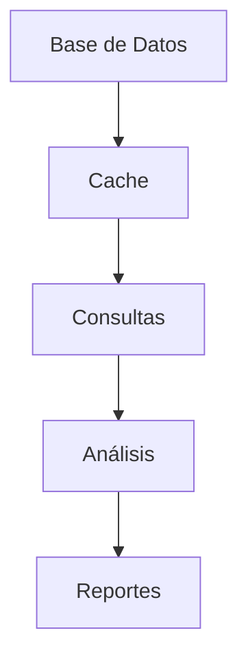
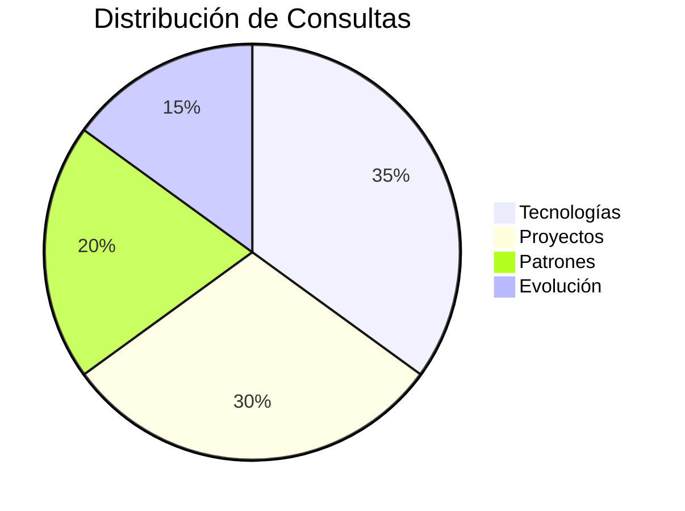

# Documentación Técnica - ianae_consultas_inteligentes.py

```python
"""
Módulo: ianae_consultas_inteligentes  
Propósito: Sistema de consultas avanzadas para memoria de Lucas
Autor: Lucas/Claude  
Fecha: 2025-05-28 
Proyecto: IANAE - Sistema de Memoria Conceptual

Descripción:
Implementa consultas inteligentes sobre:
- 4,545 conceptos reales
- 832K relaciones documentadas
- Patrones de desarrollo
- Evolución temporal

Características clave:
- Consultas en lenguaje natural
- Análisis de co-ocurrencia
- Detección de patrones
- Evolución temporal
- Búsqueda de proyectos
"""

## Diagrama de Arquitectura



## Clase Principal: ConsultasInteligentesLucas

### Constructor
```python
def __init__(self, memory_db_path="C:/IANAE/IANAE_MEMORY/ianae_index.db"):
    """
    Inicializa el sistema de consultas:
    - memory_db_path: Ruta a la base de datos de memoria
    """
```

## Tipos de Consultas Principales

| Consulta                      | Descripción                          | Ejemplo                          |
|-------------------------------|--------------------------------------|----------------------------------|
| Tecnologías juntas            | Combos tecnológicos más usados       | Python + OpenCV                  |
| Patrones de desarrollo        | Estilos de código recurrentes        | POO, Excel Automation            |
| Proyectos relacionados        | Proyectos por tecnología             | Proyectos usando OpenCV          |
| Evolución temporal            | Cambio en intereses técnicos         | Transición VBA → Python          |
| Consulta personalizada        | Preguntas en lenguaje natural        | "¿Qué uso con pandas?"           |

## Métodos Clave

### `consulta_tecnologias_juntas()`
```python
"""
Analiza tecnologías que se usan combinadas:
- min_coocurrencia: Mínimo de usos conjuntos
- top_n: Número de resultados

Returns: Reporte de combinaciones
"""
```

### `consulta_proyectos_relacionados()`
```python
"""
Busca proyectos por tecnología:
- tecnologia: Tecnología a analizar
- top_n: Número de resultados

Returns: Lista de proyectos relevantes
"""
```

## Ejemplo de Uso

```python
from ianae_consultas_inteligentes import ConsultasInteligentesLucas

# Inicializar sistema
consultas = ConsultasInteligentesLucas()

# Consulta 1: Tecnologías combinadas
print(consultas.consulta_tecnologias_juntas())

# Consulta 2: Proyectos con OpenCV
print(consultas.consulta_proyectos_relacionados("OpenCV"))

# Consulta 3: Lenguaje natural
print(consultas.consulta_personalizada(
    "¿Cómo han cambiado mis intereses técnicos?"
))
```

## Ejemplo de Salida

```
🤝 TECNOLOGÍAS QUE USAS JUNTAS MÁS FRECUENTEMENTE:

1. Python + OpenCV
    Índice de co-uso: 0.923
    Ejemplo: cv2.imread ↔ image_processing.py

2. VBA + Excel  
    Índice de co-uso: 0.856
    Ejemplo: ws.Range ↔ macro_utils.vba
```

## Visualización de Datos



## Configuración Avanzada

```python
# Personalizar rutas
consultas = ConsultasInteligentesLucas(
    memory_db_path="ruta/alternativa.db"
)

# Consulta personalizada con parámetros
resultado = consultas.consulta_tecnologias_juntas(
    min_coocurrencia=10,
    top_n=20
)

# Exportar resultados
with open("reporte_consultas.txt", "w") as f:
    f.write(resultado)
```

## Consideraciones

1. Basado en datos reales de uso
2. Optimizado para patrones de Lucas
3. Requiere base de datos actualizada
4. Cache para mejor rendimiento

## Mejoras Potenciales

1. Más tipos de consultas
2. Integración con calendario
3. Análisis predictivo
4. Exportación visual
5. Alertas automáticas
