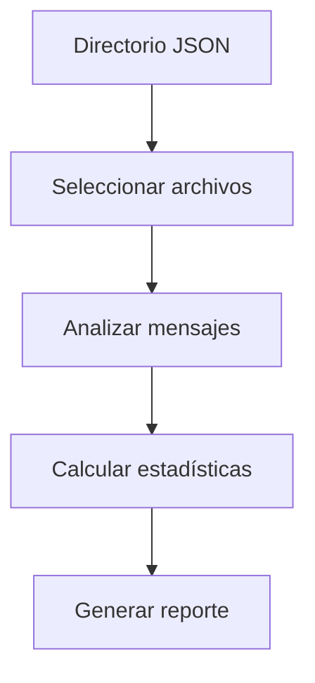

# Documentación Técnica - deep_content_analysis.py

```python
"""
Módulo: deep_content_analysis  
Propósito: Análisis estadístico de contenido en conversaciones
Autor: Lucas/Claude  
Fecha: 2025-05-28 
Proyecto: IANAE - Sistema de Memoria Conceptual

Descripción:
Analiza contenido de mensajes en archivos JSON para:
- Calcular estadísticas de longitud
- Extraer muestras representativas
- Generar métricas de calidad
- Identificar patrones de contenido

Características clave:
- Análisis de primeros 10 archivos
- Estadísticas por mensaje
- Muestras de contenido
- Métricas agregadas
"""

## Diagrama de Flujo



## Función Principal: analyze_message_content()

```python
def analyze_message_content():
    """
    Analiza contenido de mensajes en:
    - C:/IANAE/memory/conversations_database
    
    Procesa los primeros 10 archivos y primeros 5 mensajes por archivo
    Genera reporte con:
    - Estadísticas de longitud
    - Muestras de contenido
    - Métricas agregadas
    """
```

## Métricas Calculadas

| Métrica               | Descripción                  |
|-----------------------|------------------------------|
| Total mensajes        | Cantidad total de mensajes   |
| Mensajes con contenido| Mensajes con texto válido    |
| Longitud promedio     | Promedio de caracteres       |
| Longitud máxima       | Mensaje más largo            |
| Longitud mínima       | Mensaje más corto            |

## Ejemplo de Uso

```python
from deep_content_analysis import analyze_message_content

# Ejecutar análisis
analyze_message_content()

# Salida esperada:
"""
🔍 ANÁLISIS PROFUNDO DEL CONTENIDO
==================================================

📁 000_IANAE_MEMORY_SUMMARY.json
------------------------------
  Mensaje 1: 120 chars
    Preview: Resumen del sistema IANAE...
  Mensaje 2: 85 chars  
    Preview: Conceptos principales...
  Total: 5 mensajes, 3 con contenido

📊 ESTADÍSTICAS GENERALES:
Files analizados: 3
Messages totales: 15  
Messages con contenido: 9
Longitud promedio: 142.3 chars
Longitud máxima: 320 chars
Longitud mínima: 12 chars
"""
```

## Ejemplo de Salida Completa

```
🔍 MUESTRAS DE CONTENIDO:

1. 001_Installing_Debian.json (245 chars):
   Cómo instalar Debian 12 en X88 Pro 13 TV Box...

2. 002_Tacografos.json (320 chars):  
   Procesamiento de imágenes de tacógrafos usando OpenCV...
```

## Configuración

```python
# Para modificar parámetros:
- Cambiar ruta en conversations_path
- Ajustar límite de archivos (files_checked < 10)
- Modificar límite de mensajes (data['messages'][:5])
```

## Consideraciones

1. Analiza solo primeros 10 archivos y 5 mensajes por rendimiento
2. Considera contenido válido con más de 10 caracteres
3. Muestra previews de 100 caracteres
4. Omite mensajes vacíos o sin contenido

## Mejoras Potenciales

1. Análisis completo con progreso
2. Detección de temas principales
3. Análisis de sentimiento
4. Exportación a CSV/JSON
5. Integración con estadísticas temporales
