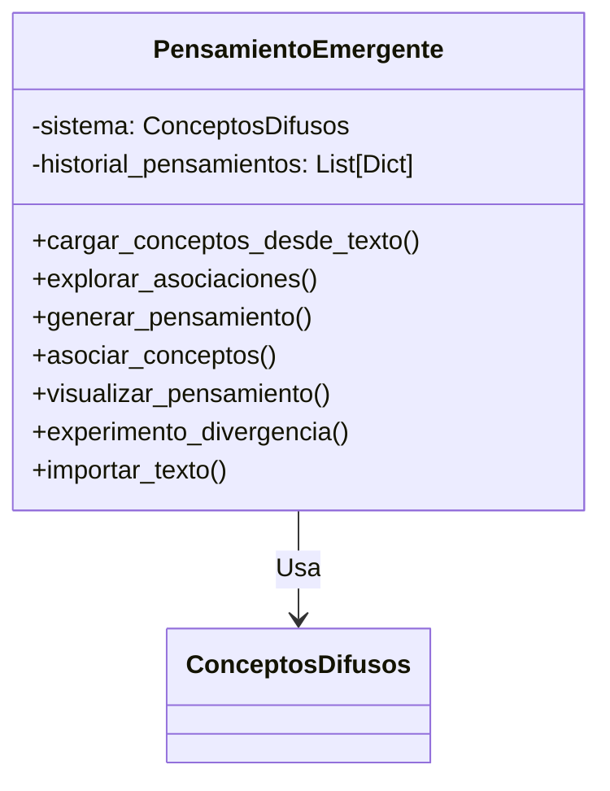

# 📚 Documentación Técnica - emergente.py

## 🏗️ Diagrama de Arquitectura


## 🧠 Clase Principal

### `PensamientoEmergente`
```python
class PensamientoEmergente:
    """
    Sistema para generar pensamientos emergentes basados en redes de conceptos
    
    Características clave:
    - Extracción automática de conceptos desde texto
    - Generación de cadenas de pensamiento
    - Exploración de asociaciones conceptuales
    - Visualización de redes de pensamiento
    - Experimentos de divergencia creativa
    """
```

## 🔍 Métodos Principales

### `cargar_conceptos_desde_texto()`
```python
def cargar_conceptos_desde_texto(self, texto, max_conceptos=30):
    """
    Extrae conceptos desde texto y construye relaciones basadas en co-ocurrencia
    
    Args:
        texto: Texto de entrada
        max_conceptos: Máximo de conceptos a extraer
        
    Returns:
        Lista de conceptos añadidos
        
    Ejemplo:
    >>> pe = PensamientoEmergente()
    >>> pe.cargar_conceptos_desde_texto("La inteligencia artificial...")
    ['inteligencia', 'artificial', 'aprendizaje', ...]
    """
```

### `generar_pensamiento()`
```python 
def generar_pensamiento(self, semilla=None, longitud=5, temperatura=0.3):
    """
    Genera una cadena de pensamiento emergente
    
    Args:
        semilla: Concepto inicial (opcional)
        longitud: Número de conceptos en la cadena
        temperatura: Control de aleatoriedad
        
    Returns:
        Texto con la secuencia de conceptos
        
    Ejemplo:
    >>> pe.generar_pensamiento("IA", longitud=4)
    "Pensamiento: IA → aprendizaje → redes → neuronales"
    """
```

## 📊 Visualización

### `visualizar_pensamiento()`
```python
def visualizar_pensamiento(self, indice=-1):
    """
    Muestra visualización de un pensamiento del historial
    
    Args:
        indice: Índice del pensamiento (-1 para el último)
        
    Muestra:
        - Texto del pensamiento
        - Grafo de activaciones
    """
```

### `experimento_divergencia()`
```python
def experimento_divergencia(self, concepto, num_rutas=5, longitud=4):
    """
    Genera múltiples rutas de pensamiento divergentes
    
    Args:
        concepto: Concepto inicial
        num_rutas: Número de rutas a generar
        longitud: Longitud de cada ruta
        
    Returns:
        Texto con las rutas generadas
        Muestra visualización de todas las rutas
    """
```

## 💡 Ejemplos de Uso

### Ejemplo 1: Carga y generación básica
```python
from emergente import PensamientoEmergente

# Crear sistema
pe = PensamientoEmergente()

# Cargar conceptos desde texto
texto = "La inteligencia artificial se basa en el aprendizaje automático..."
pe.cargar_conceptos_desde_texto(texto)

# Generar pensamiento
pensamiento = pe.generar_pensamiento("IA")
print(pensamiento)
```

### Ejemplo 2: Exploración de asociaciones
```python
# Explorar conexiones entre conceptos
asociaciones = pe.asociar_conceptos("redes", "neuronales")
print(asociaciones)

# Visualizar el último pensamiento
pe.visualizar_pensamiento()
```

## 🧩 Dependencias Clave
- `numpy`: Para operaciones probabilísticas
- `matplotlib`: Para visualización
- `networkx`: Para manipulación de grafos
- `nucleo.py`: Para el núcleo de conceptos difusos

## ⚙️ Configuración
```python
# Parámetros importantes:
dim_vector = 20       # Dimensionalidad de vectores conceptuales
max_conceptos = 30    # Límite de conceptos a extraer de texto
temperatura = 0.3     # Control de aleatoriedad en generación
longitud_pensamiento = 5  # Conceptos por pensamiento
```

## 🚀 Roadmap de Mejoras
1. [ ] Integración con modelos de lenguaje
2. [ ] Análisis semántico avanzado
3. [ ] Persistencia de historial
4. [ ] Interfaz interactiva
5. [ ] Métricas de calidad de pensamientos

## ⚠️ Consideraciones
- Requiere texto de entrada significativo
- La calidad depende de los conceptos cargados
- Visualización puede ser intensiva para redes grandes
