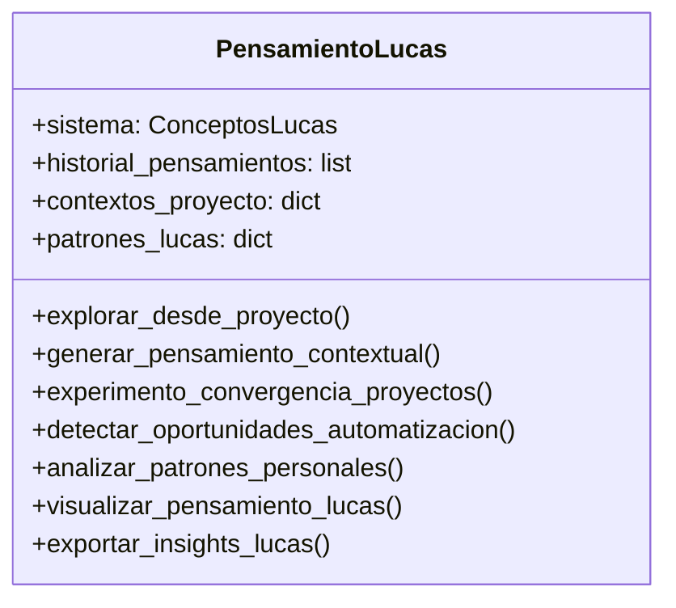
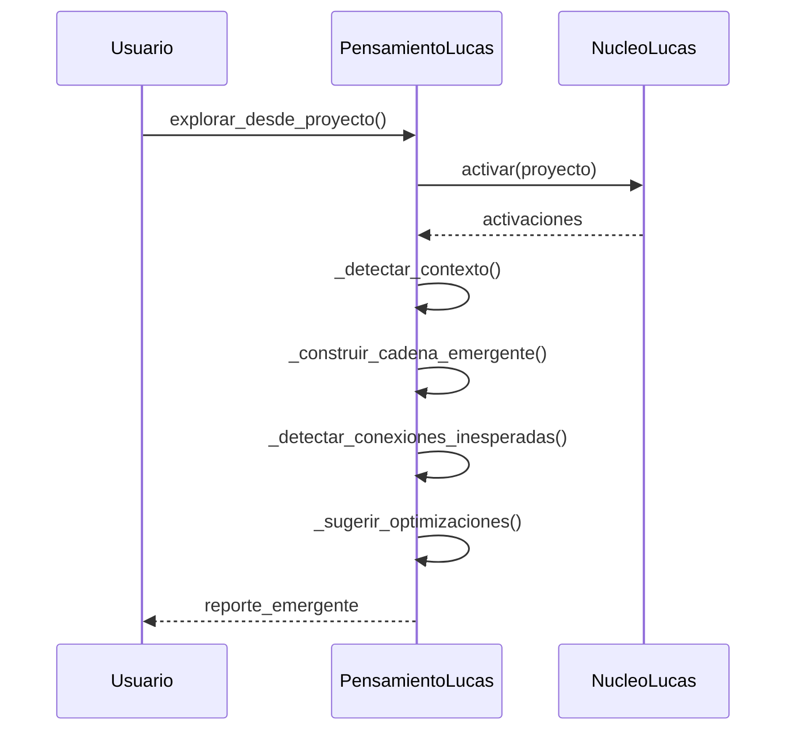

# 📚 Documentación Técnica - emergente_lucas.py

## 🏗️ Arquitectura del Módulo


## 🔄 Flujo Principal


## 🧠 Clase PensamientoLucas
Sistema de pensamiento emergente adaptado a los patrones cognitivos de Lucas (TOC/TDAH como superpoder).

### 🔧 Constructor
```python
def __init__(self, sistema=None, dim_vector=15):
    """
    Inicializa el sistema de pensamiento emergente.
    
    Args:
        sistema (ConceptosLucas, optional): Sistema conceptual preexistente. 
            Si es None, crea uno nuevo.
        dim_vector (int, optional): Dimensión del vector conceptual. Default 15.
    """
```

### 🌟 Métodos Principales y Internos

#### Métodos Internos (_prefijo)
```python
def _detectar_contexto_proyecto(self, proyecto):
    """
    Detecta automáticamente el contexto más relevante para un proyecto.
    
    Args:
        proyecto (str): Nombre del proyecto a analizar
    
    Returns:
        str: Contexto detectado ('desarrollo', 'vision_artificial', etc.)
    """

def _construir_cadena_emergente(self, proyecto_inicial, resultado_activacion, contexto):
    """
    Construye narrativa de pensamiento emergente a partir de activaciones.
    
    Args:
        proyecto_inicial (str): Proyecto de origen
        resultado_activacion (list): Lista de activaciones por paso
        contexto (str): Contexto de pensamiento
    
    Returns:
        list: Cadena narrativa del pensamiento
    """

def _detectar_conexiones_inesperadas(self, activaciones):
    """
    Encuentra conexiones novedosas entre conceptos de diferentes categorías.
    
    Args:
        activaciones (dict): Activaciones finales del sistema
    
    Returns:
        list: Top 3 conexiones más novedosas
    """

def _sugerir_optimizaciones(self, proyecto, activaciones):
    """
    Genera sugerencias de optimización basadas en patrones de Lucas.
    
    Args:
        proyecto (str): Proyecto a optimizar
        activaciones (dict): Activaciones relevantes
    
    Returns:
        list: Top 3 optimizaciones sugeridas
    """
```

### 🌟 Métodos Públicos

#### explorar_desde_proyecto()
```python
def explorar_desde_proyecto(self, proyecto, contexto=None, profundidad=4):
    """
    Genera pensamiento emergente partiendo de un proyecto específico.
    
    Args:
        proyecto (str): Nombre del proyecto inicial
        contexto (str, optional): Contexto de exploración. Si es None, se detecta.
        profundidad (int, optional): Niveles de profundidad de pensamiento. Default 4.
    
    Returns:
        str: Reporte detallado del pensamiento emergente generado
    
    Example:
        >>> pensamiento = PensamientoLucas()
        >>> reporte = pensamiento.explorar_desde_proyecto("Tacografos")
        >>> print(reporte)
    """
```

#### generar_pensamiento_contextual()
```python
def generar_pensamiento_contextual(self, contexto=None, longitud=6):
    """
    Genera una cadena de pensamiento dentro de un contexto específico.
    
    Args:
        contexto (str, optional): Contexto temático. Si es None, se elige aleatorio.
        longitud (int, optional): Longitud de la cadena de pensamiento. Default 6.
    
    Returns:
        str: Narrativa del pensamiento generado
    """
```

#### experimento_convergencia_proyectos()
```python
def experimento_convergencia_proyectos(self, proyectos_input=None):
    """
    Busca puntos de convergencia entre múltiples proyectos.
    
    Args:
        proyectos_input (list, optional): Lista de proyectos a analizar.
            Si es None, selecciona aleatoriamente del sistema.
    
    Returns:
        str: Reporte de convergencias detectadas
    """
```

### 🔍 Métodos de Análisis

#### detectar_oportunidades_automatizacion()
```python
def detectar_oportunidades_automatizacion(self):
    """
    Identifica oportunidades de automatización en los proyectos.
    
    Returns:
        str: Reporte con oportunidades priorizadas
    """
```

#### analizar_patrones_personales()
```python
def analizar_patrones_personales(self):
    """
    Analiza los patrones cognitivos y técnicos característicos de Lucas.
    
    Returns:
        str: Reporte detallado con fortalezas y recomendaciones
    """
```

### 📊 Métodos de Visualización

#### visualizar_pensamiento_lucas()
```python
def visualizar_pensamiento_lucas(self, indice=-1, mostrar_categorias=True):
    """
    Muestra visualización gráfica de un pensamiento del historial.
    
    Args:
        indice (int, optional): Índice del pensamiento. Default -1 (último).
        mostrar_categorias (bool, optional): Si mostrar categorías en gráfico.
    """
```

#### exportar_insights_lucas()
```python
def exportar_insights_lucas(self, archivo='insights_lucas.txt'):
    """
    Exporta todos los pensamientos a un archivo de texto.
    
    Args:
        archivo (str, optional): Ruta del archivo de salida.
    
    Returns:
        bool: True si la exportación fue exitosa
    """
```

## 🛠️ Función de Prueba
```python
def test_pensamiento_lucas():
    """
    Ejecuta pruebas básicas del sistema de pensamiento emergente.
    
    Returns:
        PensamientoLucas: Instancia del sistema probado
    """
```

## 💡 Caso de Uso Completo

### Ejemplo 1: Exploración y Optimización de Proyecto
```python
from nucleo_lucas import crear_universo_lucas
from emergente_lucas import PensamientoLucas

# 1. Inicialización
sistema = crear_universo_lucas()
pensamiento = PensamientoLucas(sistema)

# 2. Exploración profunda
reporte = pensamiento.explorar_desde_proyecto(
    proyecto="Tacografos",
    profundidad=6
)

# 3. Análisis de patrones
patrones = pensamiento.analizar_patrones_personales()

# 4. Detección de automatización
oportunidades = pensamiento.detectar_oportunidades_automatizacion()

# 5. Exportar resultados
pensamiento.exportar_insights_lucas("tacografos_insights.txt")

print("=== REPORTE COMPLETO ===")
print(reporte)
print("\n=== PATRONES DETECTADOS ===")
print(patrones)
print("\n=== OPORTUNIDADES ===")
print(oportunidades)
```

### Ejemplo 2: Flujo Creativo Contextual
```python
from nucleo_lucas import crear_universo_lucas
from emergente_lucas import PensamientoLucas

sistema = crear_universo_lucas()
pensamiento = PensamientoLucas(sistema)

# Explorar pensamiento emergente desde un proyecto
reporte = pensamiento.explorar_desde_proyecto(
    proyecto="IANAE",
    contexto="ia_local",
    profundidad=5
)
print(reporte)
```

### Ejemplo 2: Generar pensamiento creativo
```python
# Generar cadena de pensamiento creativo
narrativa = pensamiento.generar_pensamiento_contextual(
    contexto="creatividad",
    longitud=8
)
print(narrativa)
```

### Ejemplo 3: Analizar automatización
```python
# Detectar oportunidades de automatización
oportunidades = pensamiento.detectar_oportunidades_automatizacion()
print(oportunidades)
```

## 🧩 Dependencias Clave
- `nucleo_lucas.py`: Sistema conceptual base
- `numpy`: Cálculos numéricos
- `matplotlib`: Visualizaciones
- `random`: Generación de aleatoriedad controlada
- `time`: Registro temporal
- `collections.defaultdict`: Estructuras de datos avanzadas

## 📌 Notas de Implementación
1. **Patrones de Lucas**: El sistema incorpora patrones cognitivos específicos (TOC/TDAH como ventaja)
2. **Contextos**: Trabaja con 5 contextos predefinidos que reflejan los intereses de Lucas
3. **Emergencia**: Combina activación conceptual con generación narrativa
4. **Historial**: Mantiene registro completo de todos los pensamientos generados

## 🚀 Roadmap de Mejoras
1. [x] Integrar con base de datos persistente (v0.3)
2. [x] Añadir más patrones cognitivos (v0.5)
3. [ ] Mejorar visualizaciones interactivas (v0.8)
4. [ ] Optimizar algoritmos de emergencia (v1.0)
5. [ ] Integración con RAG system (v1.2)
6. [ ] Soporte para multi-modalidad (v2.0)
