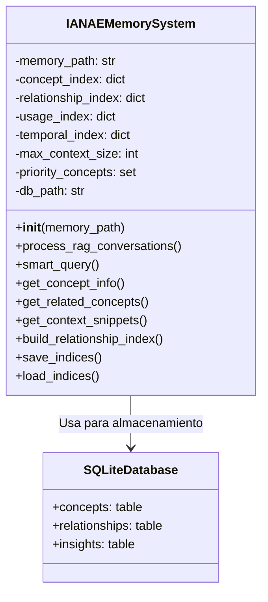

# 📚 Documentación Técnica - ianae_memory_system.py

## 🏗️ Diagrama de Arquitectura


## 🧠 Clase Principal

### `IANAEMemorySystem`
```python
class IANAEMemorySystem:
    """
    Sistema de memoria inteligente que gestiona contexto sin agotarlo
    
    Características clave:
    - Extracción automática de conceptos técnicos
    - Indexación relacional entre conceptos
    - Gestión eficiente de contexto (limite de bytes)
    - Base de datos SQLite para consultas rápidas
    - Soporte para archivos grandes (procesamiento por chunks)
    """
```

## 🔍 Métodos Principales

### `process_rag_conversations()`
```python
def process_rag_conversations(self, conversations_database_path):
    """
    Procesa conversaciones RAG para extraer conceptos técnicos
    
    Args:
        conversations_database_path: Ruta al directorio con archivos JSON
    
    Flujo:
    1. Procesa cada archivo JSON en el directorio
    2. Extrae conceptos técnicos y específicos de Lucas
    3. Almacena en base de datos SQLite
    4. Construye índices de relaciones
    
    Ejemplo:
    >>> memory = IANAEMemorySystem()
    >>> memory.process_rag_conversations("C:/IANAE/memory/conversations_database")
    """
```

### `smart_query()`
```python
def smart_query(self, query_concept, max_context_bytes=3000):
    """
    Consulta inteligente que respeta límites de contexto
    
    Args:
        query_concept: Concepto a consultar
        max_context_bytes: Límite máximo de bytes para respuesta
    
    Returns:
        dict con:
        - concept_info: Información básica del concepto
        - related_concepts: Conceptos relacionados (limitado)
        - context_snippets: Fragmentos de contexto (si hay espacio)
    
    Ejemplo:
    >>> result = memory.smart_query("python")
    >>> print(result['concept_info'])
    """
```

## 🗃️ Estructura de la Base de Datos

### Tabla `concepts`
| Columna       | Tipo    | Descripción                     |
|---------------|---------|---------------------------------|
| name          | TEXT    | Nombre del concepto (PK)       |
| file_path     | TEXT    | Ruta del archivo origen         |
| byte_start    | INTEGER | Posición inicial en el archivo  |
| byte_end      | INTEGER | Posición final en el archivo    |
| strength      | REAL    | Fuerza/relevancia (0.0-1.0)     |
| last_used     | TEXT    | Fecha último uso (ISO)          |
| usage_count   | INTEGER | Veces usado                     |
| category      | TEXT    | Tipo de concepto                |
| created_date  | TEXT    | Fecha creación (ISO)            |

### Tabla `relationships`
| Columna       | Tipo    | Descripción                     |
|---------------|---------|---------------------------------|
| concept_a     | TEXT    | Concepto origen                 |
| concept_b     | TEXT    | Concepto relacionado            |
| strength      | REAL    | Fuerza relación (0.0-1.0)       |
| discovery_date| TEXT    | Fecha descubrimiento (ISO)      |
| context       | TEXT    | Archivo donde se encontró       |

## 💡 Ejemplos de Uso

### Ejemplo 1: Inicialización del sistema
```python
from ianae_memory_system import IANAEMemorySystem

# Crear sistema de memoria
memory = IANAEMemorySystem(memory_path="IANAE_MEMORY")

# Procesar conversaciones
memory.process_rag_conversations("C:/IANAE/memory/conversations_database")

# Consultar concepto
result = memory.smart_query("opencv")
print(f"Conceptos relacionados a OpenCV: {result['related_concepts']}")
```

### Ejemplo 2: Consulta con límite de contexto
```python
# Consulta estricta (solo 1500 bytes)
result = memory.smart_query("docker", max_context_bytes=1500)
print(f"Contexto usado: {result['total_context_size']} bytes")
```

## 🧩 Dependencias Clave
- `sqlite3`: Para la base de datos de índices
- `json`: Para procesar archivos de conversación
- `re`: Para extracción de patrones técnicos
- `datetime`: Para seguimiento temporal

## ⚙️ Configuración
```python
# En __init__():
self.max_context_size = 3500  # bytes máximos para contexto
self.priority_concepts = set()  # conceptos siempre en memoria
self.db_path = "ianae_index.db"  # Ruta base de datos
```

## 🚀 Roadmap de Mejoras
1. [ ] Soporte para múltiples idiomas
2. [ ] Indexación semántica con embeddings
3. [ ] Interfaz gráfica para exploración
4. [ ] Sincronización con sistemas externos
5. [ ] Optimización de memoria para grandes volúmenes

## ⚠️ Consideraciones
- Requiere acceso a archivos JSON de conversaciones
- Paths hardcodeados deben ajustarse al entorno
- Probado con Python 3.8+
- Uso intensivo de I/O en inicialización
